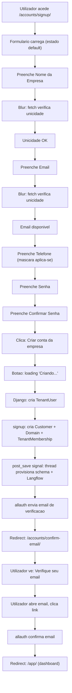
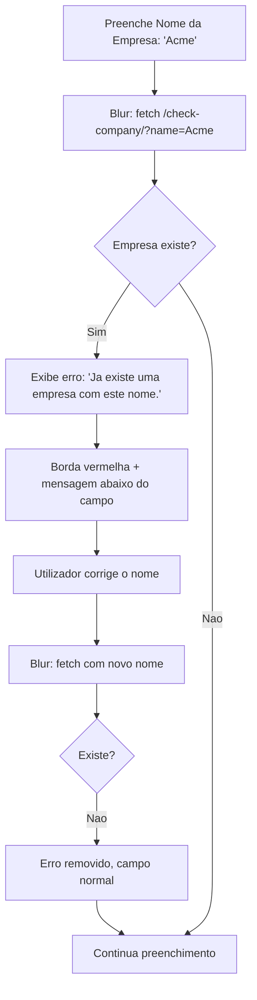
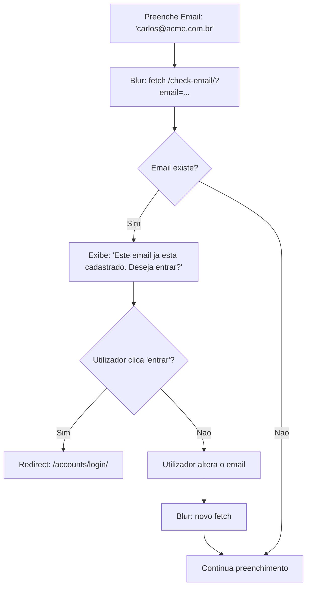
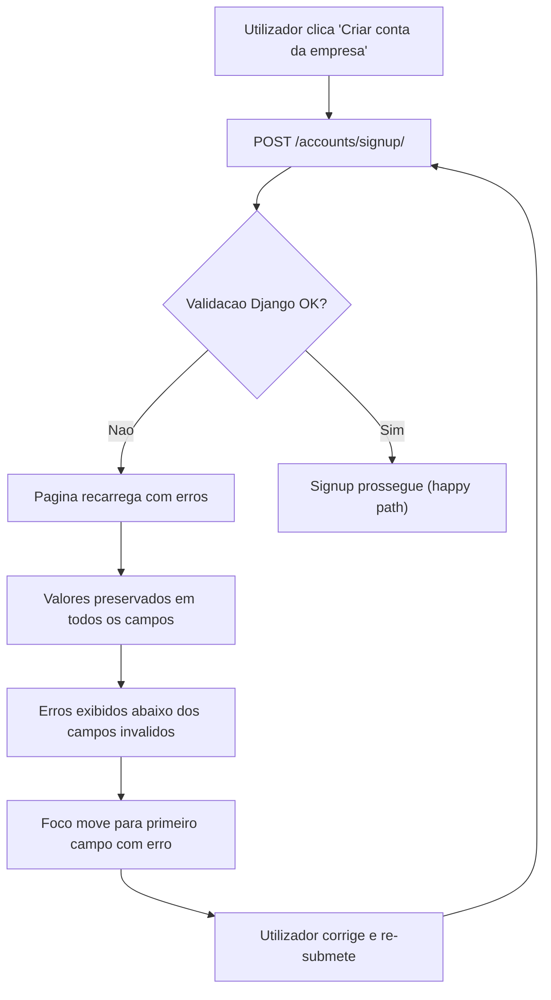
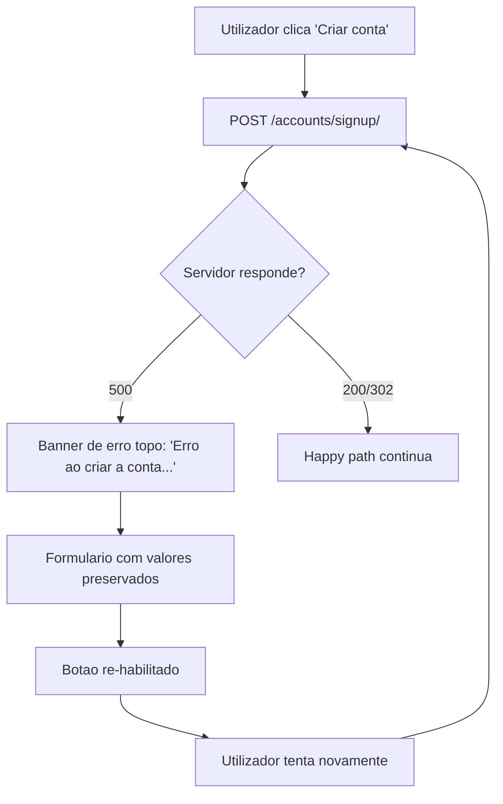
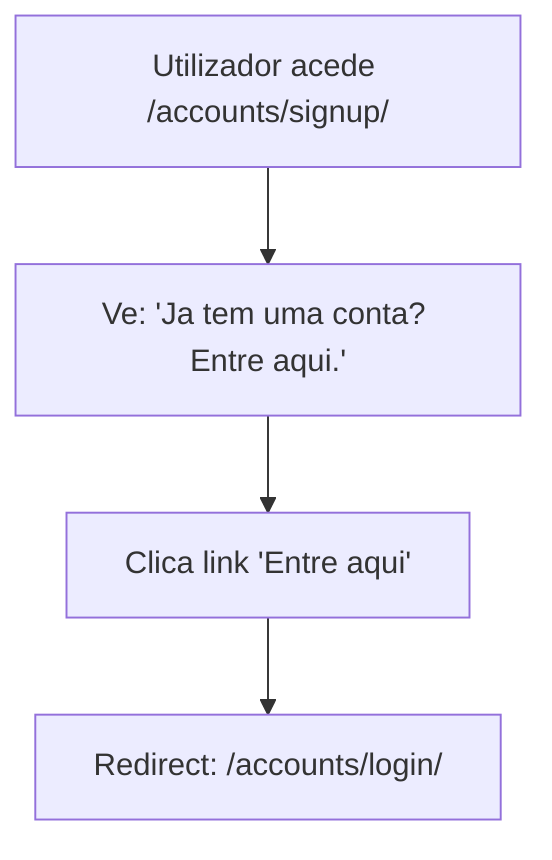
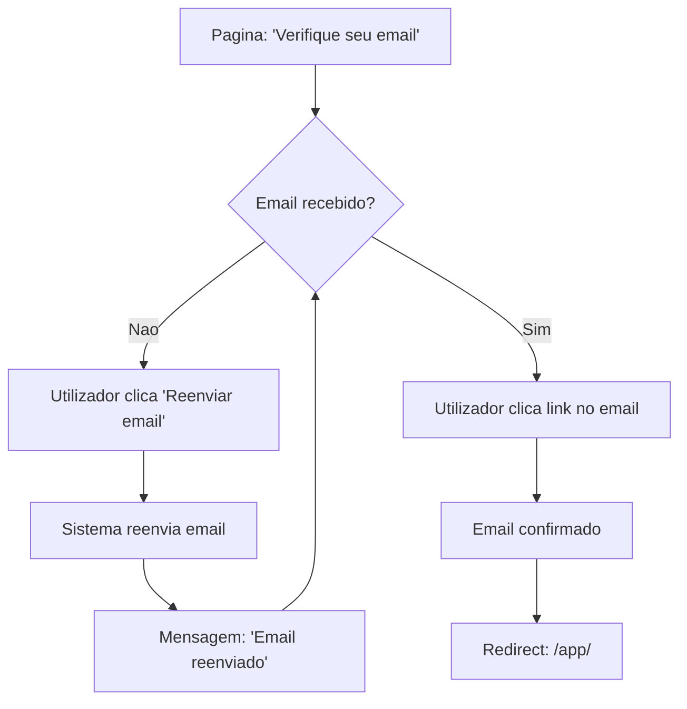

# User flows — Cadastro empresarial com provisionamento de tenant

---

## Flow 1: Cadastro completo (happy path)

### Entry points
- Utilizador clica em "Criar conta" ou "Cadastre-se" na landing page ou pagina de login.
- Utilizador acede directamente a `/accounts/signup/` via link partilhado.

### Happy path



### Steps (detalhe)

1. Utilizador acede a `/accounts/signup/`.
2. Sistema renderiza formulario com 5 campos vazios + labels + help text.
3. Utilizador preenche "Nome da Empresa" e sai do campo (blur).
4. Sistema faz fetch para `/accounts/check-company/?name=X` — responde OK.
5. Utilizador preenche "Email" e sai do campo (blur).
6. Sistema faz fetch para `/accounts/check-email/?email=X` — responde OK.
7. Utilizador preenche "Telefone" — mascara formata automaticamente.
8. Utilizador preenche "Senha" e "Confirmar Senha".
9. Utilizador clica "Criar conta da empresa".
10. Sistema desabilita formulario, botao mostra "Criando...".
11. Django/allauth cria TenantUser (schema publico).
12. `SignupExtraForm.signup()` cria Customer + Domain + TenantMembership(role=owner).
13. Signal `post_save` dispara thread de provisionamento (schema + Langflow).
14. allauth envia email de verificacao.
15. Redirect para pagina de confirmacao de email.
16. Utilizador verifica email via link.
17. Redirect para `/app/`.

---

## Flow 2: Erro de validacao inline — empresa ja existe



---

## Flow 3: Erro de validacao inline — email ja cadastrado



---

## Flow 4: Erro de validacao server-side (submit)



### Cenarios de erro server-side

| Cenario | Causa | Mensagem | Acao de recuperacao |
|---------|-------|----------|---------------------|
| Race condition: empresa criada entre fetch e submit | Dois signups simultaneos | "Ja existe uma empresa com este nome. Escolha outro." | Alterar nome e re-submeter |
| Race condition: email registado entre fetch e submit | Dois signups simultaneos | "Este email ja esta cadastrado." | Alterar email ou ir para login |
| Senha demasiado curta | Validacao allauth | "A senha deve ter pelo menos 8 caracteres." | Corrigir senha |
| Senha demasiado comum | Validacao allauth | "Esta senha e muito comum. Escolha outra." | Escolher senha diferente |
| Senhas nao conferem | password1 != password2 | "As senhas nao conferem." | Corrigir confirmacao |
| Schema name reservado | "langflow", "public", etc. | "Este nome nao pode ser utilizado." | Escolher outro nome |

---

## Flow 5: Erro de servidor (500)



---

## Flow 6: Navegacao para login (utilizador ja tem conta)



---

## Flow 7: Reenvio de email de verificacao



---

## State machine — Formulario de signup

```mermaid
stateDiagram-v2
    [*] --> Default: pagina carrega

    Default --> Filling: utilizador digita

    Filling --> InlineChecking: blur em email ou empresa
    InlineChecking --> InlineError: unicidade falhou
    InlineChecking --> InlineSuccess: unicidade OK
    InlineError --> Filling: utilizador corrige
    InlineSuccess --> Filling: continua preenchimento

    Filling --> Submitting: clica Criar conta
    InlineSuccess --> Submitting: clica Criar conta

    Submitting --> ValidationError: erros de validacao
    Submitting --> ServerError: erro 500
    Submitting --> Success: signup OK

    ValidationError --> Filling: utilizador corrige
    ServerError --> Filling: utilizador tenta novamente

    Success --> EmailVerification: redirect

    EmailVerification --> EmailResent: clica reenviar
    EmailResent --> EmailVerification: volta a esperar
    EmailVerification --> Verified: clica link no email

    Verified --> Dashboard: redirect /app/
```

---

## Decisoes de design documentadas

| Decisao | Alternativa descartada | Justificativa |
|---------|----------------------|---------------|
| Formulario single-page | Wizard multi-step | 5 campos nao justificam wizard. Single page reduz percepcao de complexidade. |
| Validacao inline + server-side | Apenas server-side | Inline reduz erros no submit e melhora percepcao de responsividade. Server-side e fonte de verdade. |
| "Nome da Empresa" primeiro | Email primeiro (padrao allauth) | Comunica contexto B2B imediatamente. Diferencia de signup pessoal. |
| Mascara de telefone | Campo livre | Reduz erros de formato. Padrao esperado em sites brasileiros. |
| Provisioning no signup() | Provisioning via session + signal | Directo, atomico, testavel. Elimina fragilidade de dados na session. |
| Link para login no formulario | Apenas na navbar | Reduz abandono de utilizadores que ja tem conta. Padrao universal. |
| Help text permanente | Help text on hover/focus | Visivel para todos sem interaccao. Essencial para persona Marina. |
