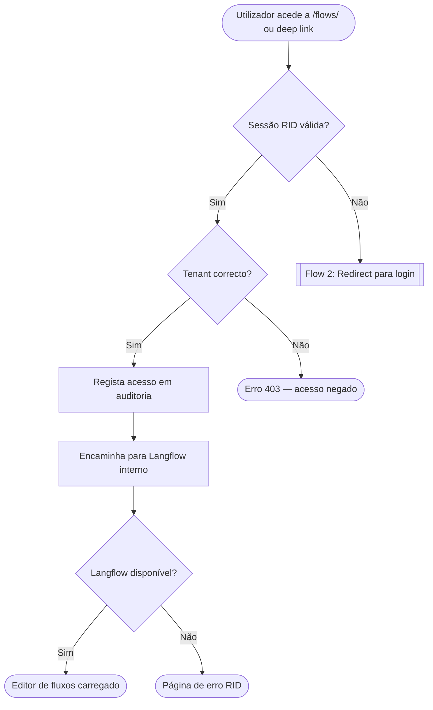
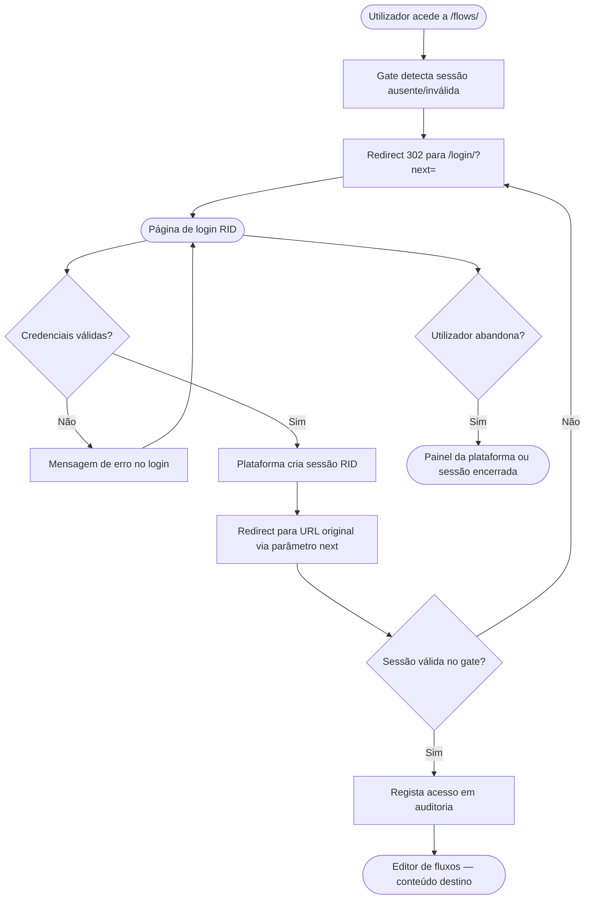
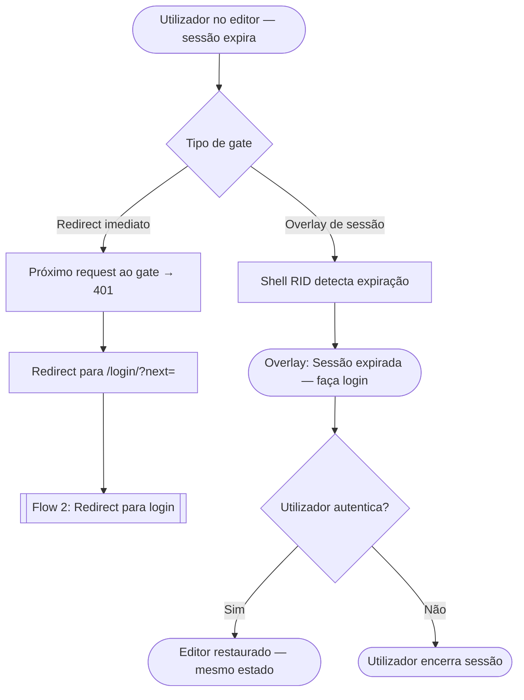
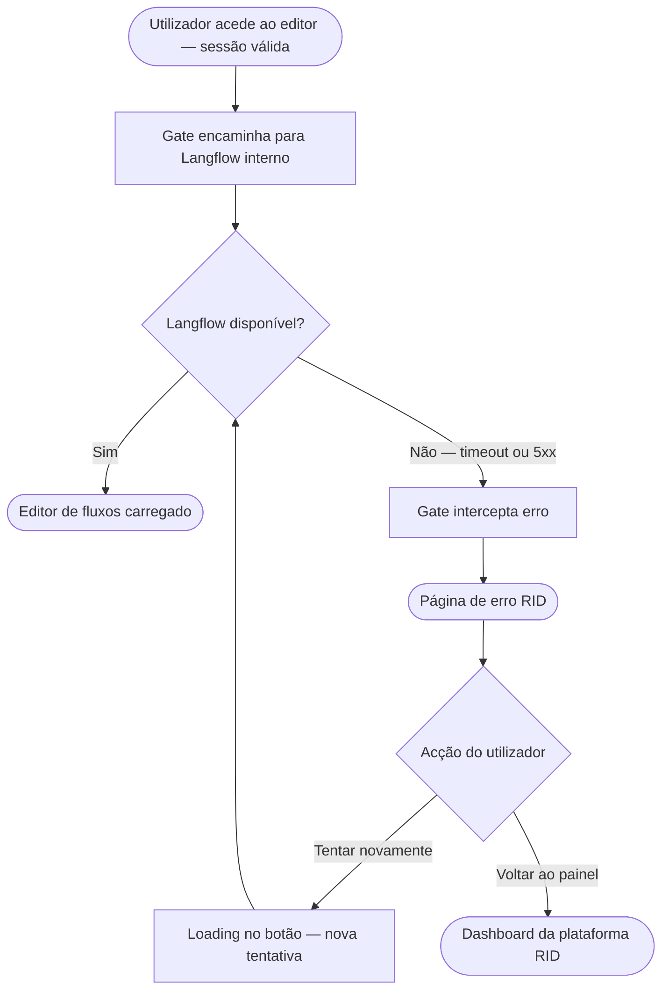
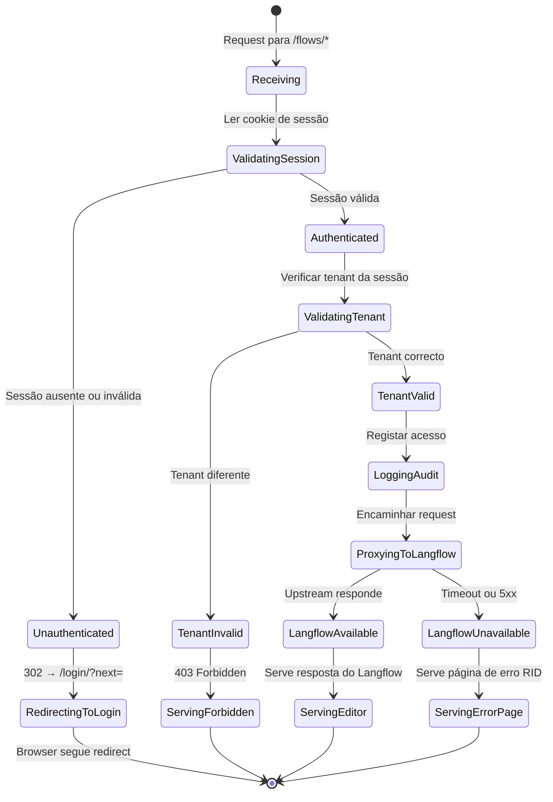

# User flows — Entrada única autenticada para o editor de fluxos

**Nota de topologia:** Este feature é um proxy/auth gate de infraestrutura. A Langflow SPA não é modificada. Os fluxos documentados aqui descrevem o comportamento do perímetro de autenticação — o que o utilizador experiencia antes de aterrar no editor, e o que vê quando o editor está indisponível.

---

## Flow 1: Acesso autenticado ao editor (happy path)

### Entry points
- Utilizador clica em link "Editor de Fluxos" no painel da plataforma RID (sessão activa).
- Utilizador abre bookmark do URL do editor (sessão activa no browser).
- Utilizador acede a deep link partilhado por colega (sessão activa).

### Happy path
1. Utilizador navega para o URL do editor (`/flows/` ou deep link `/flows/<id>`).
2. Gate de autenticação valida sessão RID — sessão válida encontrada.
3. Gate regista acesso nos trilhos de auditoria (tenant, utilizador, timestamp, URL).
4. Gate verifica isolamento de tenant — utilizador pertence ao tenant do path.
5. Gate encaminha request para o upstream Langflow interno.
6. Langflow responde com a SPA ou o fluxo específico.
7. Utilizador vê o editor de fluxos directamente, sem interrupção.

### Alternative paths
- **Se utilizador actualiza a página:** passos 2–7 repetem-se; sessão ainda válida → editor recarrega.
- **Se utilizador acede ao URL antigo (`:7861`):** em produção/staging retorna 404 ou redirect permanente (301) para `/flows/`.

### Exit points
- **Success:** Utilizador trabalha no editor de fluxos.
- **Abandon:** Utilizador fecha a tab — sem impacto no fluxo.

### Diagram

---

## Flow 2: Utilizador não autenticado acede ao editor (redirect flow)

### Entry points
- Utilizador não autenticado tenta aceder ao URL do editor (sem sessão, sessão expirada, ou novo browser).
- Utilizador recebe deep link de colega e não tem sessão activa.
- Utilizador tenta aceder ao editor a partir de link em email ou documentação.

### Happy path
1. Utilizador navega para `/flows/` ou `/flows/<id>` sem sessão RID válida.
2. Gate de autenticação detecta ausência ou invalidade de sessão.
3. Gate devolve redirect HTTP 302 para `/login/?next=<url-original-encoded>`.
4. Browser do utilizador carrega a página de login da plataforma RID.
5. Utilizador insere as suas credenciais e submete o formulário de login.
6. Plataforma RID autentica o utilizador e cria sessão.
7. Plataforma RID lê o parâmetro `next` e redireciona para o URL original.
8. Gate de autenticação valida a nova sessão — válida.
9. Gate regista acesso em auditoria.
10. Utilizador aterra no editor (ou no fluxo específico do deep link).

### Alternative paths
- **Se login falhar (credenciais incorrectas):** utilizador permanece na página de login com mensagem de erro; parâmetro `next` é preservado para nova tentativa.
- **Se utilizador abandona o login:** parâmetro `next` não é consumido; utilizador retorna ao painel da plataforma (ou página de login sem `next`).
- **Se URL de destino for inválido (fluxo apagado):** utilizador aterra no editor com o erro nativo do Langflow para fluxo não encontrado — fora do escopo deste feature.

### Exit points
- **Success:** Utilizador autenticado aterra no editor com o conteúdo destino.
- **Failure (login falha):** Utilizador permanece na página de login.
- **Abandon:** Utilizador fecha o browser ou navega para outra página.

### Diagram

---

## Flow 3: Sessão expira durante uso do editor

### Entry points
- Utilizador está a trabalhar no editor de fluxos quando a sessão RID expira.

### Trigger
- Expiração natural da sessão Django (timeout configurado na plataforma).
- Sessão invalidada administrativamente (logout remoto, rotação de token).

### Behavior (a definir no TRD — HIGH severity issue)

**Estado actual do PRD:** não especificado. O comportamento depende da implementação do gate:

- **Opção A (redirect imediato):** o próximo request ao gate retorna 401 → redirect para login com `next=<url-actual>`. Utilizador perde estado não guardado no editor.
- **Opção B (overlay de sessão expirada):** o shell RID detecta expiração e apresenta overlay "Sessão expirada — faça login para continuar" sem navegar para fora do editor. Após re-autenticação, sessão é restaurada.

**Decisão:** Opção B — overlay "Sessão expirada" com botão "Entrar novamente" que redireciona para `/flows/` após re-autenticação. Evita perda de estado e mantém o utilizador no contexto do editor.

### Diagram

---

## Flow 4: Editor de fluxos indisponível (error page)

### Entry points
- Qualquer acesso ao editor (autenticado ou redirect pós-login) quando o upstream Langflow não responde.

### Trigger
- Serviço Langflow parado ou a reiniciar.
- Timeout de rede entre o proxy/gate e o contentor Langflow.
- Langflow retorna 5xx.

### Happy path (do ponto de vista do utilizador)
1. Utilizador acede ao editor (autenticado).
2. Gate valida sessão — válida.
3. Gate tenta encaminhar para Langflow interno.
4. Langflow não responde (timeout) ou retorna 5xx.
5. Gate intercepta o erro antes de devolvê-lo ao browser.
6. Gate serve a página de erro com identidade visual RID.
7. Utilizador vê: título claro, mensagem explicativa, e acções de recuperação.
8. Utilizador tenta "Tentar novamente" ou "Voltar ao painel".

### Alternative paths
- **Se retry resulta em sucesso:** utilizador é levado para o editor normalmente.
- **Se retry falha novamente:** página de erro mantida; botão "Tentar novamente" mostra estado de loading durante a tentativa.
- **Se utilizador clica "Voltar ao painel":** redirect para o dashboard da plataforma RID.

### Diagram

---

## State machine — Auth gate

Diagrama de estados do gate de autenticação para uma request ao editor:

